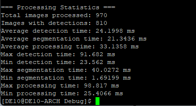
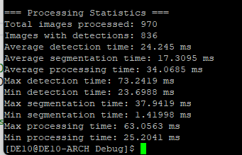

# CPU Preprocessing Pipeline

This folder contains the complete CPU-side image preprocessing and detection pipeline used for the Real-Time License Plate Recognition System Using FPGA.

---

## Overview

The CPU pipeline prepares input images for robust, real-time license plate recognition. It includes:

1. **License Plate Detection**  
   - Utilizes the [NanoDet](https://github.com/RangiLyu/nanodet) object detection model, deployed with [ncnn](https://github.com/Tencent/ncnn) in C++.
   - Rapidly locates license plate bounding boxes in input frames.

2. **Plate Segmentation & Straightening**  
   - Crops each detected plate and geometrically warps ("straightens") it into a 1D strip.
   - This normalization step ensures plates are fed to the FPGA OCR engine in a consistent, optimal format—regardless of rotation, skew, or aspect ratio in the original image.

3. **INT8 vs Non-INT8 Benchmarking**  
   - The pipeline can output results in either standard or INT8 format.
   - **On this ARM Cortex-A9 CPU, converting to INT8 has negligible impact on total processing time**—the CPU is slow enough that conversion overhead is minimal.
   - Detection and segmentation performance is essentially unchanged between int8 and float output.

---


## Directory Structure
```
CPU_preprocessing/
├── src/ # C++ source files for detection, segmentation, and main pipeline
│ ├── nanodet_ncnn.cpp
│ ├── ImageSegmenter.cpp
│ ├── benchmark.cpp
│ ├── nanodet_ncnn.cpp
│ ├── nanodet_ncnn.h
│ └── ...
├── models/ # NanoDet model files
├── notebooks/ # Jupyter notebooks for algorithm experiments, visualization, and dataset prep
├── doc/
│ └── images/
│ ├── benchmark_int8.png
│ └── benchmark_ withou_ int8.png
└── README.md # This file
```

---

## Pipeline Benchmarks

Performance measured on **ARM Cortex-A9 MPCore CPU** (DE10 Standard, 970 image test set):

- **Average detection time:** ~24ms
- **Average segmentation time:** 17–21ms
- **Average total pipeline time:** 33–34ms per image

**Detection accuracy** (detection + segmentation, not including OCR): **86%**

#### Example Output (INT8 Pipeline)



#### Example Output (Standard Pipeline)



**Note:**  
- On this CPU, using INT8 output does **not** significantly affect the pipeline runtime compared to standard output.
- The OCR (hardware) stage is independent and not affected by the output type here.

---

## Key Files

- `nanodet_ncnn.cpp` / `nanodet_ncnn.h`  
  Implements the NanoDet-based license plate detector using the ncnn framework.

- `ImageSegmenter.cpp` / `ImageSegmenter.h`  
  Handles segmentation and geometric straightening of detected license plates.

- `benchmark.cpp`  
  Utility for benchmarking and verifying pipeline runtime and per-stage timing.  
  (Loads test images, runs the pipeline, and logs detection/segmentation times.)

---

## Reproducing Benchmarks

1. Place your test images in the appropriate input directory (see `benchmark.cpp` for config).
2. Compile the pipeline (`src/`), ensuring ncnn and OpenCV are installed.
3. Run `benchmark.cpp` to generate timing statistics and output plots.

---

## License

See main repository for licensing and citation details.

---

*For questions, bug reports, or collaboration, open an issue in the main repo or contact the project maintainer.*
