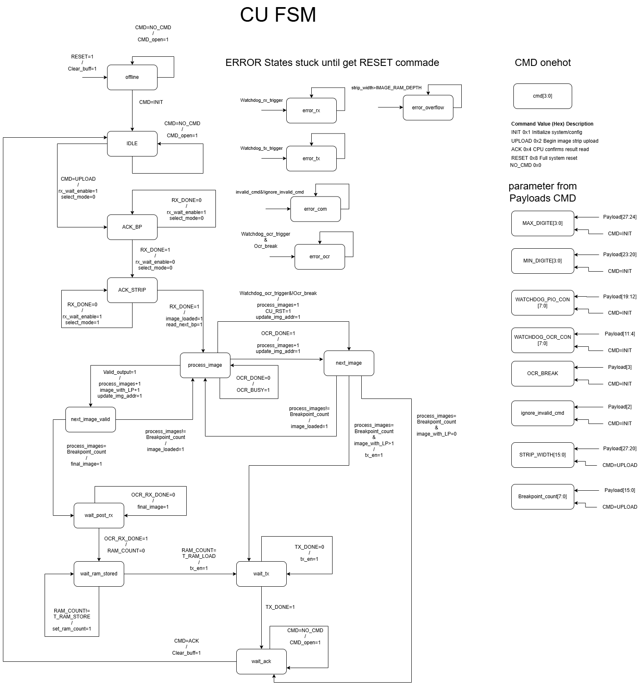
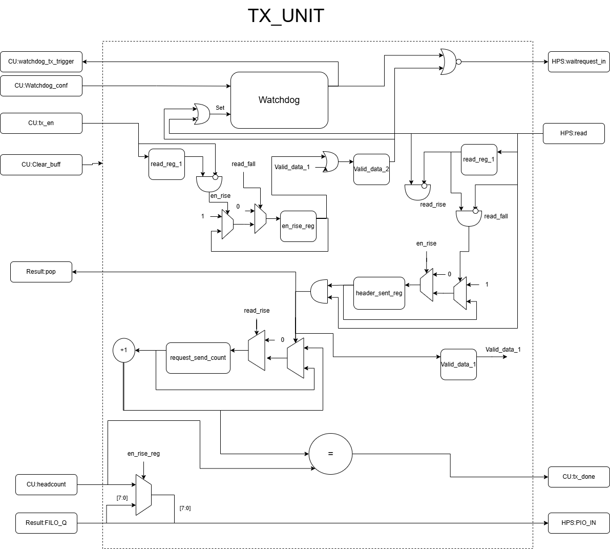
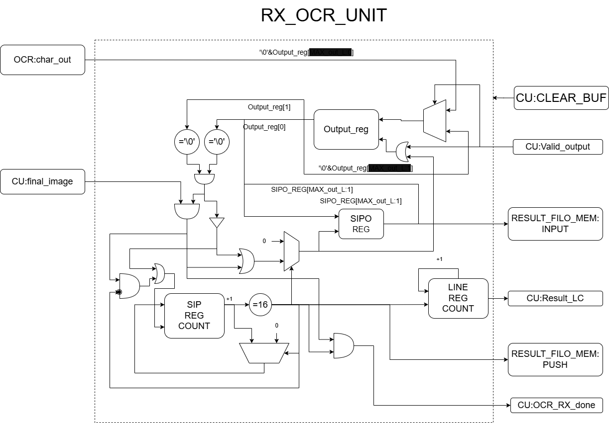
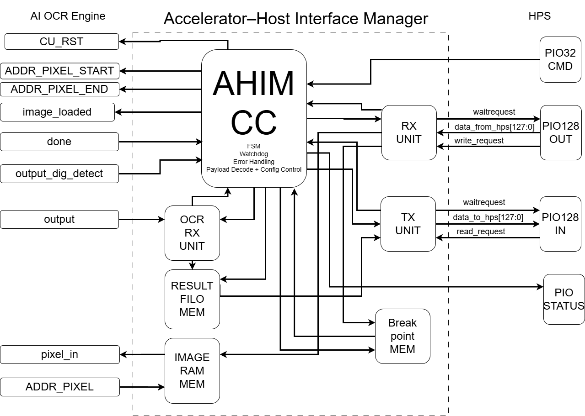

# AHIM Hardware Design Overview

This section details the Accelerator Host Interface Manager (AHIM) implementation, which serves as the central logic block for the CPU-FPGA bridge.  
The AHIM integrates four main modules—each with specialized RAM blocks—to enable robust, autonomous, and high-throughput OCR acceleration.

---


## Folder Structure

```
├── architecture/ # Block/architecture diagrams and system overviews
├── blocks/ # (Optional) Reusable HDL blocks, parameterized IPs
├── docs/ # Hardware-specific docs: tables, specs, timing notes
├── fpga_src/ # Main SystemVerilog/VHDL source code
├── FSMs/ # FSM/state machine diagrams (drawio, png)
├── testbench/ # Testbenches and simulation results
│ └── fpga_src/
└── readme.md # This file
```

---

## Folder Descriptions

- **architecture/**  
  High-level architecture diagrams, dataflow block charts, and system overviews (e.g., RX_UNIT, CU FSM, full system).

- **blocks/**  
  (Optional/for future use) – For reusable or parameterized HDL submodules such as general-purpose RAM, FIFOs, or custom IP blocks.

- **docs/**  
  Markdown, tables, port maps, and timing charts specific to hardware. Place register maps, interface specs, and deep-dive notes here.

- **fpga_src/**  
  Main HDL (SystemVerilog/VHDL) source code for:
    - `AHIM.sv` – Top-level bridge (instantiates all submodules).
    - `ahim_core_controller.sv` – CU FSM/controller and protocol decode.
    - `RX_UNIT.sv`, `TX_UNIT.sv` – Receive and transmit modules for data/command exchange with HPS.
    - `OCR_RX_UNIT.sv` – Result capture and formatting from AI OCR core.
    - `Breakpoint_RAM.v`, `dp_ram_ver.v` – Dual-port RAM for image and breakpoint storage.
    - `Result_FILO.sv` – LIFO buffer for result storage.
    - `ahim_config_pkg.sv`, `ocr_rx_pkg.sv` – Package files (parameters, types).
    - *Other support files as needed.*

- **FSMs/**  
  State machine diagrams (editable `.drawio` and exported `.png`).  
  Includes CU FSM, RX/TX FSMs, and result handling logic.

- **testbench/fpga_src/**  
  Testbenches for all core modules, e.g.:
    - `tb_Bridge_CU.sv` – Full bridge top-level test
    - `tb_RX_UNIT.sv`, `tb_TX_UNIT.sv`, `tb_OCR_RX_UNIT.sv` – Individual module tests
    - `.png` files – Example waveform or simulation outputs

- **readme.md**  
  This file. Start here for hardware folder organization, build instructions, and navigation help.

---

## Component Overview

The AHIM bridge integrates several critical components:


## 1. Memory Blocks (RAMs)

- **IMAGE_RAM_MEM**  
  - Simple dual-port RAM.
  - **Write:** by RX_UNIT (from HPS, via PIO)  
  - **Read:** by AI OCR Core (inference)
- **Break_point_RAM**  
  - Dual-port RAM with asymmetric port widths.  
  - **Write:** 128-bit (from HPS, via RX_UNIT)  
  - **Read:** 16-bit (by ahim_core_controller)  
  - Stores breakpoint indices for LP boundaries in the image strip.
- **RESULT_LIFO (RESULT_FIFO_MEM)**  
  - LIFO buffer for OCR results.  
  - **Write:** by RX_OCR (as 128-bit words, packed from character output)  
  - **Read:** by TX_UNIT for HPS retrieval.  
  - Ensures latest results are sent first; handles variable-length result strings.

---

## 2. AHIM Core Controller (FSM)

- **Central FSM** that:
    - Decodes new commands (ignores repeats).
    - Uses a one-hot encoder for command parsing (valid/invalid/empty command detection).
    - Stores payloads and distributes them to relevant modules.
    - Triggers AI OCR start/end address update (start = previous end + 1, new end from Break_point_RAM).
    - Updates status back to the CPU via PIO_STATUS.
    - Only forwards commands that are new (not held/stale in the PIO register).
    - Contains the **OCR watchdog** and manages all error/timeout conditions.

- **Key Features:**
    - Command gating (only new, valid commands processed).
    - Hard one-hot command decoding for robust protocol enforcement.
    - Protocol state, watchdogs, and error logic are all managed here.

---

## 3. RX_UNIT (Receive Unit)

- **Modes:**
    - **select_mode = 1:** Writing to IMAGE_RAM_MEM (pixel data).
    - **select_mode = 0:** Writing to Break_point_RAM (breakpoints).
- **Address Handling:**  
    - Shared address output, reset on new session (breakpoints or image), ensures clear memory region for new batch.
- **Data Flow:**  
    - Receives breakpoints first, then image columns.
- **Watchdog:**  
    - Independent RX watchdog protects against HPS “stalling.”
    - If HPS asserts write when not ready (`waitrequest` high), RX watchdog is triggered—forces port open, triggers error signal.
    - `waitrequest` driven by `not(rx_en && !watchdog_trigger)`.
- **Burst Handling:**  
    - Final implementation does **not** use 128-bit burst mode, but accumulates four 32-bit writes before marking as a valid 128-bit word.
    - Simulation supported burst, but hardware requires four writes per 128b package.

---

## 4. TX_UNIT (Transmit Unit)

- **Watchdog:**  
    - Similar to RX, monitors outgoing data and protects against read-side stalling.
- **Data Flow:**  
    - Sends first word as header (8 bits = package count), then switches to sending result data.
    - After first valid read, switches state; after each package, closes port until next valid data.
    - Ensures valid data is present for each HPS read; compensates for M10K RAM latency.
- **Burst Handling:**  
    - No true 128b bursts in hardware; accumulates four reads before outputting one valid 128b word.

---

## 5. RX_OCR (Result Capture Unit)

- **Purpose:**  
    - Captures result from the AI OCR Core, buffers, and formats for storage.
- **Operation:**  
    - Result is “latched” for one clock after valid flag.
    - Because OCR reads L→R but result chars come R→L, RX_OCR serializes the result, stops at `'\0'`, and fills a buffer (16 chars) before writing to result RAM.
    - On buffer full or end of LP, flushes to RESULT_LIFO, ensuring results are aligned for retrieval.

---

### Implementation Notes

- **Command flow and memory layout are tightly coupled to protocol and performance constraints.**
- **Each module’s watchdog is critical for robustness**—detects and reports HPS or accelerator faults.
- **Simulation used 128-bit bursts; real hardware handles four sequential 32-bit transfers per 128b word (both RX and TX).**

---

### Block Diagrams
=
- 
- 
- 
- 
- 


---

## Testbench Validation Highlights

- **Protocol compliance:** All one-hot CMDs (INIT, UPLOAD, ACK_IRQ, RESET) tested in correct and out-of-sequence order.
- **Error states:** RX/TX/COM/OVERFLOW errors triggered by testbench, FSM halts until RESET, status output matches design.
- **Data flow:** RX_UNIT and TX_UNIT validated with single and multiple word sequences, with and without burst.
- **Watchdog:** Deliberate stalling triggers watchdog as expected, port opens/closes, error flags set/reset.
- **Result handling:** RX_OCR and RESULT_LIFO tested for single/multi-plate strings, null-terminated, edge-of-buffer flush.

See `testbench/fpga_src/` for testbenches and `results/` for simulation waveforms and logs.


For a detailed protocol breakdown, see [../docs/protocol/FPGA_HPS_Bridge_AHIM_protocol.md](../docs/protocol/FPGA_HPS_Bridge_AHIM_protocol.md)
