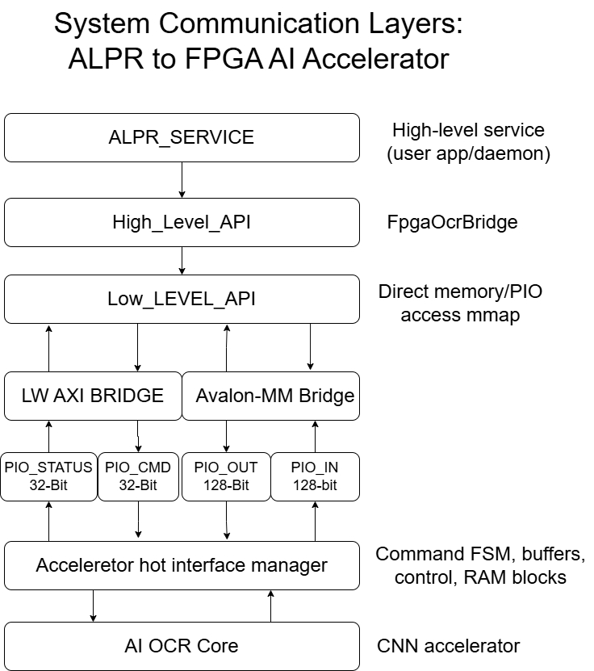
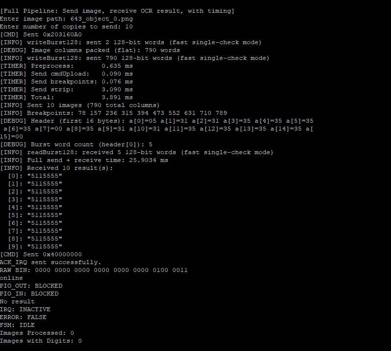
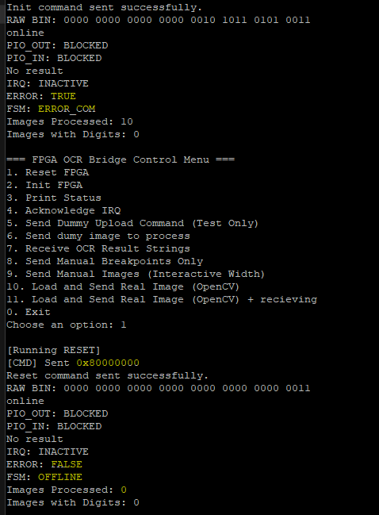

## System Communication Overview

The ALPR FPGA Bridge provides a robust, modular pathway from user-space software all the way to a real-time AI accelerator implemented on the FPGA. The diagram below illustrates the layered communication stack that powers fast and reliable license plate recognition.



## Project Structure
```
FPGA_HPS_Bridge_AHIM/
├── docs/ # Protocol, diagrams, and documentation
├── hardware/ # SystemVerilog/VHDL for the AHIM bridge, RX/TX, FSM, RAM blocks
├── software_src/ # C++ (and/or Python) API: low-level & high-level, test program
└── readme.md # This README (overview, usage, protocol links)
```

### Folder Descriptions

- **docs/**  
  Protocol documentation, block diagrams, finite state machine charts, timing diagrams, and full API/register descriptions.

- **hardware/**  
  All HDL for the AHIM bridge, including SystemVerilog modules for command decode, RX/TX units, FSM control, RAM, and module testbenches.

- **software_src/**  
  C++  code providing both low-level (register, mmap) and high-level (image, result) API access to the FPGA.  
  Includes test programs.

- **readme.md**  
  This overview, how to build/use, protocol references, and links to related modules.

---


**Data Flow (High-Level):**
- **ALPR_SERVICE** is the main application or system daemon, responsible for managing license plate recognition requests.
- **High-Level API** (`FpgaOcrBridge`) provides a user-friendly interface for sending images and receiving OCR results.
- **Low-Level API** manages direct access to FPGA registers and memory via Linux `mmap`, handling all hardware-specific operations.
- **AXI/Avalon Bridge** exposes FPGA PIOs to the CPU as memory-mapped registers.
- **PIOs** transfer commands, status, and data bursts between CPU and FPGA.
- **Accelerator Hot Interface Manager (AHIM)** coordinates all command decoding, buffering, and result handling inside the FPGA.
- **AI OCR Core** is the hardware CNN accelerator that performs real-time character recognition.

## 🚀 Demo & Showcase

The FPGA_HPS_BRIDGE_AHIM system is tested and proven in real-world conditions.  
Below are live screenshots from the integrated testbench, demonstrating batch and single image processing, error handling, API protection, blank input handling, and robust recovery.

| Scenario           | Screenshot                        | What it Proves                               |
|--------------------|-----------------------------------|----------------------------------------------|
| Single Image       |             | Fast, correct operation on one image         |
| Batch Processing   |              | High-throughput, stable multi-image run      |
| Blank Images       |           | Robust handling of empty/no-result input     |
| API Protection     | | API blocks invalid/bad commands, reports err |
| HW Error Detection |      | FPGA detects protocol error, exposes state   |
| Recovery/Reset     |        | System recovers after error—no reboot needed |

> **All images processed at hardware-accelerated speed, with round-trip latencies as low as ~2-3 ms per image. Robust error handling and reset support real-world reliability.**


For a detailed breakdown of each protocol, register map, and transaction, see [`docs/protocol/`](docs/protocol/) and [`docs/memory_map.md`](docs/memory_map.md).

