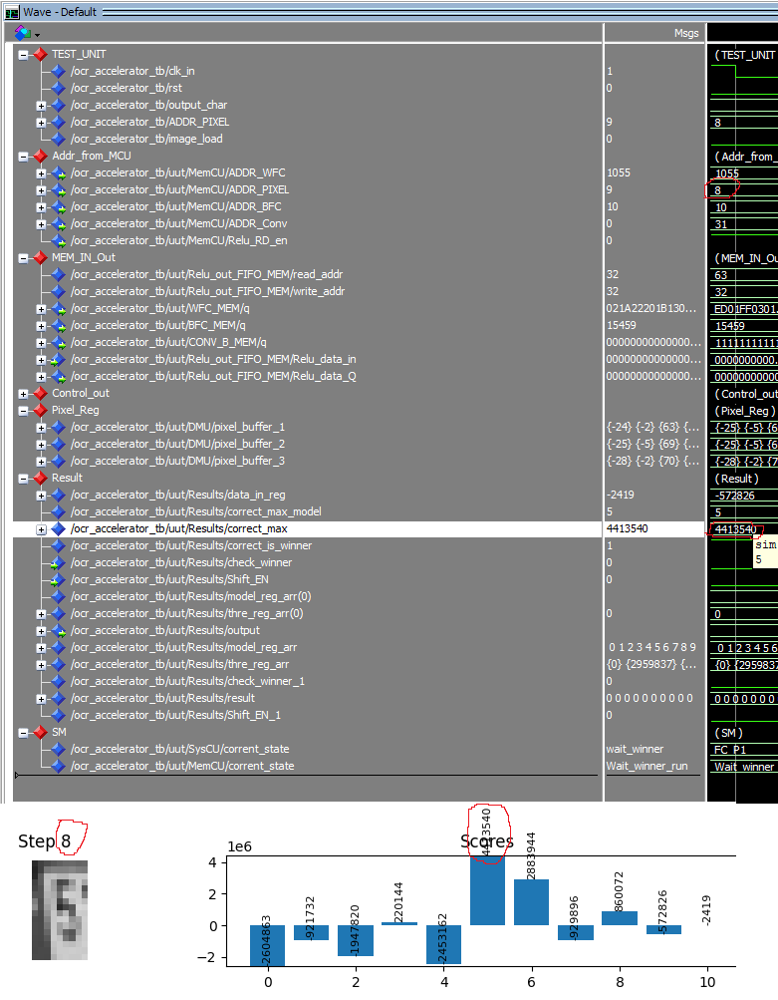
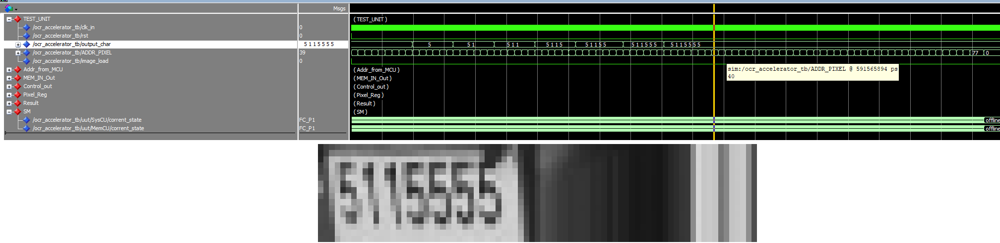
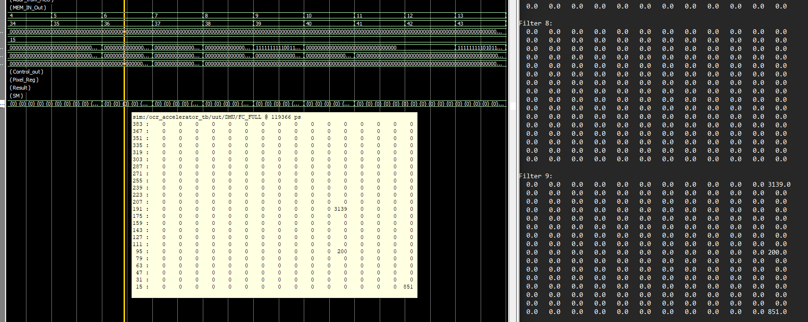

# CNN FPGA OCR Accelerator

> A fully pipelined, real-time, FPGA-based CNN classifier for Optical Character Recognition (OCR), built from the ground up — including convolution, ReLU, FC, quantization, and threshold-based decoding.

---

## 📌 Project Summary

This project implements a **digit-level OCR classifier** directly on FPGA using a custom-designed CNN architecture and a sliding window input stream. The design was developed, trained, and deployed entirely by a solo developer and runs in real time on **Cyclone V** at **57 MHz** with a **fully parameterizable and scalable structure**.

Key features:
- Supports `N` CNN models (digits `0-9` + "none")
- Sliding window classification on grayscale 16×12 patches
- Fully quantized `INT8 → INT19 → INT64` arithmetic
- Output buffer and result comparator for class thresholding

---

## 🧠 Architecture Highlights

- 16 Parallel Compute Engines (7 DSP blocks per engine → 112 total)
- MultiMultiplierEngine supports both convolution and FC modes
- DMU (Data Management Unit) handles data buffering, sorting, shifting into FC vector
- Real-time FC class score evaluation and threshold filtering
- Custom Result Comparator block confirms winning class (or none)

📂 See detailed system workflow:  

---

## 🏗️ Folder Structure
CNN_FPGA_OCR/ ├── architecture/ # High-level architecture and workflow images │ ├── CNN model.png │ ├── ocr_architecture_overview.png │ └── System WorkFlow.png

├── blocks/ # Draw.io schematics for each hardware block │ ├── data_managment_unit.drawio.png │ ├── MultiMultiplierEngine.drawio.png │ ├── Parallel_Compute_Engine_16.drawio.png │ ├── Relu_out_mem.drawio.png │ └── Results_comparator.drawio.png

├── docs/ # Documentation and RTL views │ └── RTL_view.pdf

├── fpga_src/ # VHDL source code and packages │ ├── *.vhd # All VHDL modules │ └── *_pack.vhd # Shared type/constant packages

├── FSMs/ # State machine diagrams for control units │ ├── MCU.drawio.png │ └── SM.drawio.png

├── notebooks/ # Jupyter training & export workflow │ ├── cnn_training_and_export.ipynb │ ├── fc_debug+dataset.7z │ ├── validation.png │ ├── TEST per colum.png │ └── Thresholds.txt

├── testbench/ # Simulation results and testbench code │ ├── OCR_Accelerator_tb.vhd │ ├── fpga_decoder_output_5115555.png │ ├── rtl_vs_python_fc_scores_step8.png │ └── tb_fc_vector_shift_match.png

├── weights/ # Exported model weights in .mif format │ ├── CON_W.mif # Convolution weights │ ├── CON_B.mif # Convolution biases │ ├── FCM_W.mif # Fully connected weights │ ├── FCM_B.mif # Fully connected biases │ └── REL_O.mif # ReLU defaults

└── README.md # This file!

---

## ⚙️ Target Platform

- **FPGA**: Intel Cyclone V (tested on DE10-Lite)
- **Clock**: 57 MHz stable without pipelining
- **Language**: VHDL (fully modular + synthesizable)
- **Tools**: Quartus Prime, ModelSim, Python (for training + export)

---

## 🧪 Verification

All components are verified at the RTL level:

- ✔️ FC vector matches Python reference (bit-perfect)
- ✔️ Class scores agree with PyTorch model output
- ✔️ Final output char array matches decoded result
- ✔️ Threshold logic matches activation behavior

---

## 📓 Training & Export

The CNN was trained using a custom dataset derived from cropped digits and background noise. The training pipeline includes:

- Synthetic strip generation (sliding window aligned)
- INT8 quantization (manual scale-free)
- Threshold calibration (per-class, percentile-based)
- Export to `.mif` weights, biases, and relu defaults

📂 See [`notebooks/cnn_training_and_export.ipynb`](notebooks/cnn_training_and_export.ipynb)

---

## 🚀 Live Simulation Example

---

## 📦 How to Use

1. Load `.mif` weights into FPGA memory (under `weights/`)
2. Simulate `OCR_Accelerator_tb.vhd` in ModelSim
3. View signals and output character stream in waveform
4. Compare FC vector vs Python reference

---

## 📚 Documentation

- [DMU Details](docs/dmu.md)
- [FSMs](FSMs/)
- [RTL Block Diagram](docs/RTL_view.pdf)

## 📈 Performance Summary

| Component           | Value                     |
|--------------------|---------------------------|
| Clock Frequency     | 57 MHz (measured, stable) |
| Image Size          | 16×H, H ≤ 350             |
| FC Vector Size      | 16×12×K                   |
| Class Count         | N = 10 + "none"           |
| Arithmetic          | INT8 → INT19 → INT64      |

---

## 🧩 Configurability

All architecture parameters are configurable via generics or memory files:
- ✅ Number of filters `K`
- ✅ Number of classes `N`
- ✅ Model weights/biases (`.mif`)
- ✅ Per-class thresholds (`Thresholds.txt`)
- ✅ ReLU default values (in case of underflow)

All system parameters are configurable via VHDL generics in `fpga_src/data_pack.vhd`.

Key constants include:

vhdl
-- Image and model dimensions
constant pic_height       : integer := 16;
constant sub_pic_w        : integer := 12;
constant total_filters    : integer := 64; -- Must be divisible by conv filters per block
constant num_of_classes   : integer := 10; -- Not including "none"

-- Timing control
constant T_RAM            : integer := 1;
constant T_find_winner    : integer := 2;
constant T_SET_BSC        : integer := 2;

-- Memory configuration
constant num_of_mem_banks : integer := 5;

-- Class character mapping
constant Model_outputs_str : string := "0123456789";

-- Thresholds for each class (calibrated from training)
constant integer_values_threshold : integer_array(0 to num_of_classes-1) := (
   0 => 2959837, 1 => 2312101, 2 => 2534605, 3 => 2850102, 4 => 3012197,
   5 => 2517498, 6 => 2683111, 7 => 2182753, 8 => 3229625, 9 => 2259246
);

-- MIF memory files
constant mif_name : mif := ("REL_O.mif", "FCM_W.mif", "FCM_B.mif", "CON_W.mif", "CON_B.mif");

---

## 📷 Visual Reference

> Here’s a live comparison of final output:

> And a step-by-step FC vector comparison vs Python:

---

## 💡 Motivation

This project started as a personal challenge:  
**Can one student implement a fully operational OCR pipeline, trained and deployed on FPGA — entirely solo?**

Turns out: **Yes.**  
From training to quantization, memory export, RTL design, control logic, and simulation — this is the result of that journey.

> “I wasn’t trying to optimize for speed — I was trying to build it like it would actually run in the real world.”

---

## 📷 Visual Reference

> Here’s a live comparison of final output:

> And a step-by-step FC vector comparison vs Python:

---

## 🤝 Contributing

This is a single-developer academic project. 

If you're an FPGA dev or ML-on-HW enthusiast, feel free to explore, fork, or message.

---

## 📩 Contact

Feel free to reach out via GitHub Issues or discussions.

---

## 📄 License

MIT License — use freely, but credit where due!

