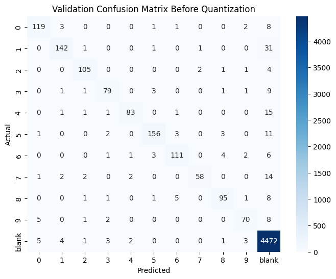
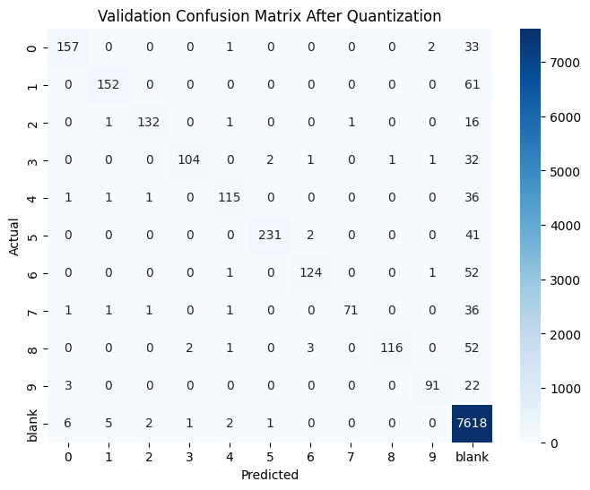

from pathlib import Path

readme_content = """
# FPGA OCR CNN Training Pipeline

This folder contains the full training and deployment pipeline for the FPGA-based OCR accelerator. The system is trained on synthetic digit data, quantized manually, and exported for deployment on a generic HDL-based CNN core.

---

## 📚 Pipeline Overview

The training notebook is divided into **four parts**, each reflecting a key stage in the workflow:

---

### 🧪 Part 1: Generate Synthetic Dataset

- Builds synthetic strips from digit-only labeled crops.
- Emulates FPGA-like behavior with a sliding window that:
  - Tracks exact digit entry and exit positions.
  - Extracts exactly one training sample per digit, just after it exits the buffer.
- Background samples are mined using pixel activity scoring.
- Outputs:
  - `train_dataset.pkl`
  - `val_dataset.pkl`

---

### 🧠 Part 2: Train CNN on INT8 Inputs + Calibrate Thresholds

- CNN architecture: single Conv2D (3×3 VALID) → ReLU → FC.
- Input data is manually normalized to `int8` in range [-128, 127].
- Training includes:
  - Label smoothing
  - L1 and L2 regularization
  - Early stopping, ReduceLROnPlateau
- Manual quantization:
  - Conv weights: `int8`
  - Conv bias: `int32`
  - FC bias: `int64` with scaling
- Threshold calibration:
  - Percentile-based
  - F1-optimized per class
- Outputs:
  - `quantized_model.pth`
  - `thresholds.json` *(used at runtime)*

---

### 💾 Part 3: Export `.mif` Files for FPGA

The trained and quantized model is exported into memory-initialization files for the FPGA accelerator.

| File        | Description                          | Format | Width × Depth |
|-------------|--------------------------------------|--------|----------------|
| `CON_W.mif` | Conv2D Weights (K filters)           | HEX    | 8 × 18         |
| `CON_B.mif` | Conv2D Biases (`int16`)              | HEX    | 16 × (K/2)     |
| `FCM_W.mif` | Fully Connected Weights              | HEX    | 8 × 128        |
| `FCM_B.mif` | Fully Connected Biases (`int64`)     | BIN    | 45 × N_CLASSES |
| `REL_O.mif` | ReLU Output for white image (input=127) | BIN | 19 × 384       |

📝 **Note:**  
- `REL_O.mif` initializes the FC input vector for the accelerator.
- It simulates a white image as the FPGA startup input.

---

### 🧪 Part 4: FPGA Emulation + FC Vector Export

- Emulates the real-time FPGA behavior on a test image.
- Slides a buffer across the image, evaluating FC scores per column.
- At each step:
  - Applies Conv → ReLU → FC
  - Compares against thresholds
  - Resets buffer if a valid detection occurs
- Optional:
  - Save FC input vector at each step to `.txt` (`fc_debug/`)
  - Visualize buffer + score histogram for debugging

---

## ⚠️ Runtime Configuration – Not Hardcoded

- **Thresholds are NOT exported to `.mif`**.
- Instead, they are specified via a **runtime config file**, along with:
  - Which characters to detect
  - Detection activation logic
- This allows the **HDL core to remain fully generic**, supporting dynamic use cases and easy reconfiguration without recompilation.

---

## ✅ Validation Results (After Quantization + Thresholding)

The model was evaluated after full INT8 quantization and per-class threshold calibration.

#### 🔍 Overall Accuracy
- **Adjusted Accuracy** *(excluding true blank predictions)*: **75.09%**
- **Digit-Only Accuracy** *(classes 0–9 only)*: **75.84%**

#### 📊 Per-Class Precision / Recall / F1

| Class | Precision | Recall | F1 Score | Support |
|-------|-----------|--------|----------|---------|
| 0     | 0.93      | 0.81   | 0.87     | 193     |
| 1     | 0.95      | 0.71   | 0.82     | 213     |
| 2     | 0.97      | 0.87   | 0.92     | 151     |
| 3     | 0.97      | 0.74   | 0.84     | 141     |
| 4     | 0.94      | 0.75   | 0.83     | 154     |
| 5     | 0.99      | 0.84   | 0.91     | 274     |
| 6     | 0.95      | 0.70   | 0.81     | 178     |
| 7     | 0.99      | 0.64   | 0.78     | 111     |
| 8     | 0.99      | 0.67   | 0.80     | 174     |
| 9     | 0.96      | 0.78   | 0.86     | 116     |
| **Blank** | 0.95  | 1.00   | 0.97     | 7635    |

---

### 🖼️ Confusion Matrix Comparison

Before quantization:

After quantization:

---

## 📂 Folder Structure

