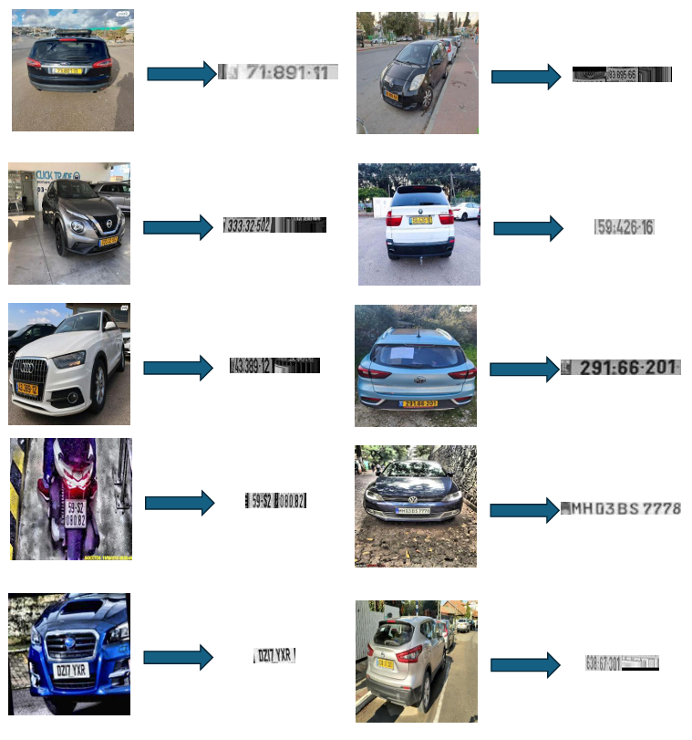

# Real-Time License Plate Recognition System Using FPGA

## Introduction

This repository contains the code for my final-year project: **Real-Time License Plate Recognition System Using FPGA**. The aim of this project is to develop a high-performance LPR system that leverages FPGA technology to enhance processing speed and accuracy compared to traditional CPU-based systems.

## Features

- **Real-Time Processing**: Achieves an average preprocessing time of **34ms**.
- **High Accuracy**: License plate recognition accuracy of **86%** in the preprocessing stage.
- **FPGA Acceleration**: Utilizes VHDL code on a DE10 Standard FPGA board to accelerate optical character recognition (OCR).
- **Advanced Image Preprocessing**: Implemented in C++ using the NanoDet object detection model and custom segmentation techniques.
- **Custom Linux Distribution**: Built for seamless integration with the FPGA hardware.

## Project Structure

- `/preprocessing`: C++ code for image preprocessing, license plate detection, and segmentation.
  - `nanodet_ncnn.cpp`: Implements the NanoDet model using ncnn for license plate detection.
  - `ImageSegmenter.cpp`: Implements custom segmentation techniques.
  - `benchmark.cpp`: Code to test and benchmark the detection and segmentation modules.
  - `/models`: NCNN model used in this project.
- `/notebooks`: Python notebooks used for initial experimentation and figuring out segmentation techniques.
  - `perproccess.ipynb`: Jupyter notebook with experiments and visualizations for segmentation.
  - `nanodot.ipynb`: Jupyter notebook with the code for preparing and combining the dataset into one.
- `/fpga`: VHDL code for FPGA implementation of the OCR process.
- `/docs`: Documentation, diagrams, and resources explaining the project components.

## How to Use

The code in this repository is provided for educational and demonstration purposes. To explore the project:

- **Review the C++ Code**: Navigate to the `/preprocessing` directory to examine the image preprocessing algorithms, including license plate detection and segmentation techniques.
- **Examine the VHDL Code**: In the `/fpga` directory, you can view the VHDL modules designed to accelerate the OCR process on the FPGA.
- **Explore the Python Notebooks**: Check the `/notebooks` directory for Jupyter notebooks that detail the segmentation experiments and visualizations.
- **Read the Documentation**: The `/docs` directory contains detailed explanations, diagrams, and reports that provide deeper insights into the project's development and architecture.

**Note**: Reproducing the complete system requires specific hardware (DE10 Standard FPGA board) and software setups, which may not be accessible to everyone.

## Building the Custom Linux Distribution

To create the custom Linux distribution for the DE10 Standard FPGA board used in this project, I followed the comprehensive guide provided by [Zangman De10-nano](https://github.com/zangman/de10-nano) and used Altera's source code. These resources cover:

- Setting up the cross-compilation environment
- Building U-Boot bootloader
- Compiling the Linux kernel with necessary configurations
- Creating the root filesystem
- Integrating necessary libraries like OpenCV

**Note**: While I followed these guides closely, I made several customizations to suit the specific requirements of this project. These modifications are documented in the [`/docs/CUSTOM_BUILD_NOTES.md`](docs/CUSTOM_BUILD_NOTES.md) file.

## Demonstrations

### Overview Architecture

*Figure 1: Overview architecture of the Real-Time License Plate Recognition System.*

### License Plate Detection Example

*Figure 2: Result of the license plate detection algorithm on a sample image.*

### FPGA OCR Module Diagram

*Figure 3: Block diagram of the FPGA-based OCR acceleration module.*

## Project Status

- **Completed**:
  - Image preprocessing algorithms implemented and tested.
  - Achieved 86% accuracy with a 34ms preprocessing time on ARM Cortex-A9 MPCore CPU.
  - Developed a custom Linux distribution for the DE10 Standard FPGA board.
- **Ongoing**:
  - Designing and coding of hardware modules in VHDL for FPGA-based OCR acceleration.
  - Integration of the FPGA OCR module with the preprocessing pipeline.
  - Further testing and optimization.

## References

1. Terasic DE10-Standard: [Terasic DE10-Standard](https://www.terasic.com.tw/cgi-bin/page/archive.pl?Language=English&No=1081)
2. Nanodet: [Nanodet](https://github.com/RangiLyu/nanodet)
3. Ncnn: [Ncnn](https://github.com/Tencent/ncnn)
4. Zangman De10-nano GitHub: [Zangman De10-nano](https://github.com/zangman/de10-nano)
5. Altera-opensource u-boot: [Altera-opensource u-boot](https://github.com/altera-opensource/u-boot-socfpga)
6. Altera-opensource linux-Kernel: [Altera-opensource linux-Kernel](https://github.com/altera-opensource/linux-socfpga)
7. Arch linux pre-built rootfs: [Arch linux pre-built rootfs](https://fl.us.mirror.archlinuxarm.org/os/)
8. License Plates Dataset by objectdetection: [License Plates Recognition Dataset](https://www.kaggle.com/objectdetection/license-plates-recognition-dataset)
9. License Plates Dataset by N N: [islipl3 Dataset](https://www.kaggle.com/nn/islipl3-dataset)
10. Israel License Plates Dataset by Gael Cohen: [license_plate_israel](https://www.kaggle.com/gaelcohen/license-plate-israel)
11. License Plates Dataset by SCH: [plate Dataset](https://www.kaggle.com/sch/plate-dataset)

## Acknowledgments

- **Supervisor**: Binyamin Abramov for guidance and support.
- **Afeka College**: For providing resources and facilities.
- **Open-Source Community**: Developers of NanoDet, OpenCV, and other tools used in this project.
