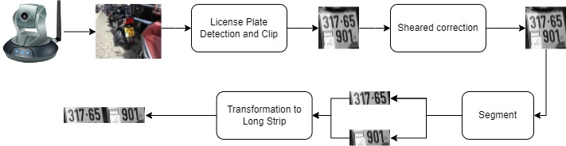
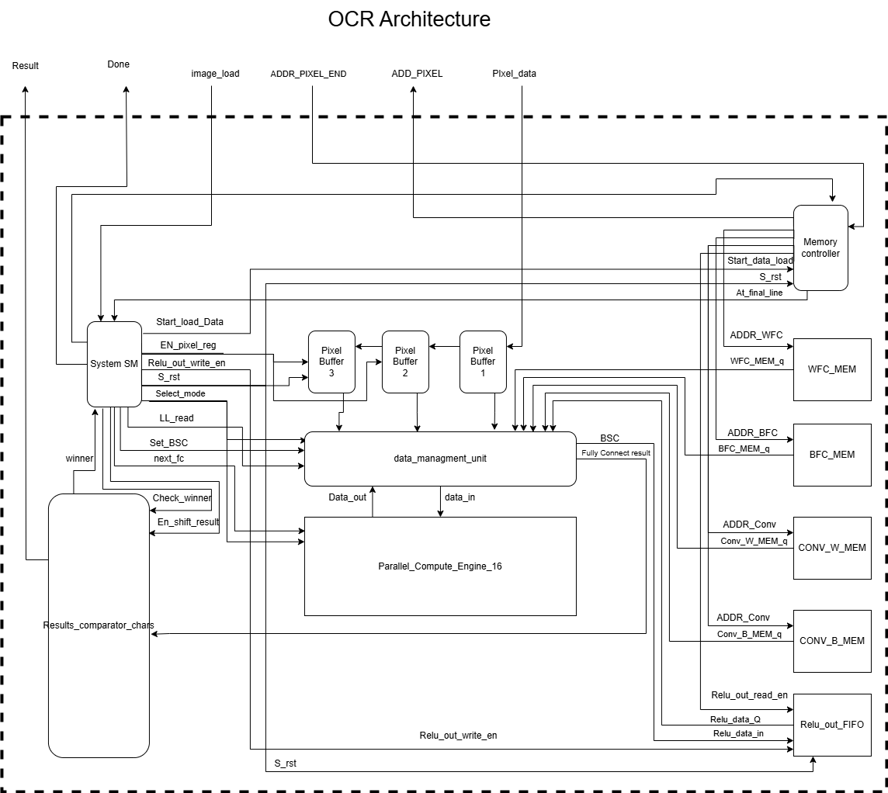
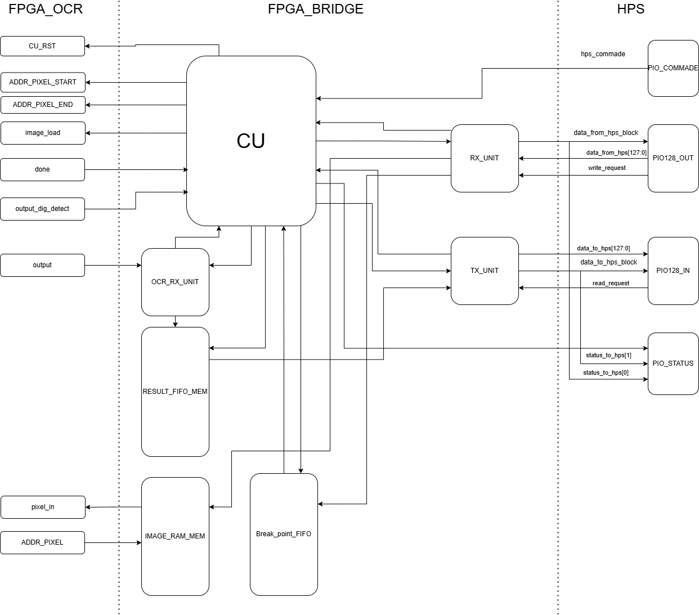
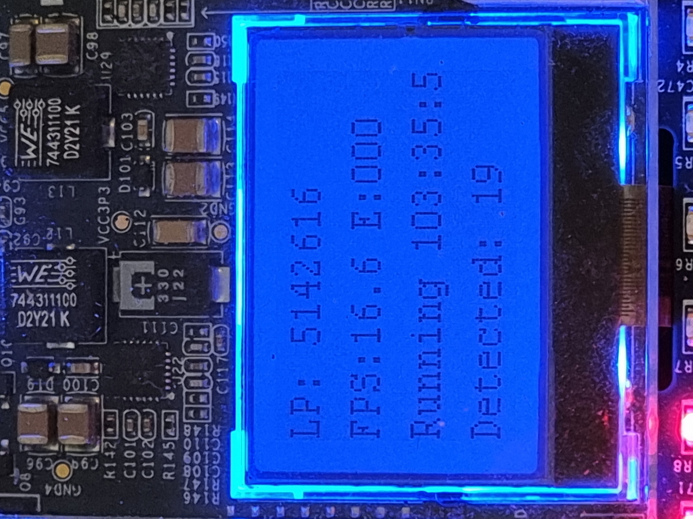

# Real-Time License Plate Recognition System Using FPGA

## Introduction

This repository contains the complete code and documentation for my final-year project: **Real-Time License Plate Recognition System Using FPGA**. The aim of this project is to develop a high-performance, real-time license plate recognition (LPR) system, leveraging advanced CPU image processing and custom hardware acceleration on an FPGA platform. The result is a robust, modular pipeline that achieves fast, accurate LPR beyond what is possible with CPU-only systems.

---

## Features

- **Real-Time Processing:** Achieves an average preprocessing time of **34ms** per image.
- **High Accuracy:** License plate recognition accuracy of **86%** in real-world test conditions.
- **FPGA Acceleration:** Utilizes VHDL/SystemVerilog on a DE10 Standard FPGA board for CNN-based OCR.
- **Advanced Image Preprocessing:** Implemented in C++ with the NanoDet object detection model and custom segmentation techniques.
- **Flexible CPU-FPGA Bridge/API:** C++ communication library for high-speed, robust CPU-to-FPGA data/control transfer.
- **Custom Linux Platform:** Kernel, U-Boot, and device tree tailored for the FPGA system, with full build scripts and documentation.
- **End-to-End Documentation:** Clear, step-by-step build guides, system diagrams, workflow charts, and performance results.

---

## Project Structure
```
├── ALPR_SYSTEM/           # Full system integration: CPU preproc, FPGA bridge, watchdog, FSM, logging
├── alprcrtl/              # CLI controller & interface for managing the OCR system
├── CPU_preprocessing/     # Detection, segmentation, and preprocessing
├── CPU_FPGA_access_API/   # Communication bridge code
├── FPGA_AHIM/             # Accelerator interface (CU / RX / TX)
├── FPGA_OCR_CNN/          # CNN OCR IP core
├── LINUX_config_files/    # Kernel, device tree, and scripts
└── docs/                  # Diagrams, documentation, notes
```


### Folder Descriptions

- **ALPR_SYSTEM/**  
  C++ COde for full integrated runtime for the ALPR pipeline. Handles FSM coordination, preprocessing, watchdog, FPGA communication, OCR triggering, and logging. Designed to run continuously and autonomously under embedded Linux.

- **alprcrtl/**  
  Command-line controller for managing and interacting with the ALPR_SYSTEM. Sends control commands, initiates single-frame capture or live runs, monitors state/status, and supports system testing/debug.

- **CPU_preprocessing/**  
  C++ and Python code for real-time license plate detection and segmentation. Includes object detection (NanoDet), segmentation routines, benchmark/test scripts, and Jupyter notebooks for experiments.

- **CPU_FPGA_access_API/**  
  C++ API/library for sending image data and control commands from the CPU (HPS) to the FPGA and receiving recognition results. Implements the full CPU-to-FPGA protocol, error handling, and demo scripts.

- **FPGA_AHIM/**  
  HDL (SystemVerilog/VHDL) for the Accelerator Host Interface Manager (“CU”/bridge). Handles all CPU-FPGA communication and command parsing at the hardware level.

- **FPGA_OCR_CNN/**  
  FPGA implementation of a quantized CNN for optical character recognition, including memory initialization files, quantization scripts, and HDL for CNN logic.  
  *(This is a copy or submodule of [CNN_FPGA_OCR](https://github.com/Eshel19/CNN_FPGA_OCR))*

- **LINUX_config_files/**  
  Kernel and U-Boot configs, device tree sources, and all scripts/files for building and configuring the custom Linux environment needed for the DE10 Standard board.

- **docs/**  
  Full documentation, system diagrams, workflow charts, build notes, and additional resources.

---

## How to Use

The code in this repository is provided for educational and demonstration purposes. To explore or reproduce the project:

1. **Image Preprocessing & Detection:**  
   - See `/CPU_preprocessing/` for C++/Python code and notebooks.  
   - Run detection and segmentation to extract plates and prepare images for FPGA OCR.

2. **CPU-FPGA Communication API:**  
   - `/CPU_FPGA_access_API/` contains the C++ interface and command-line tools to send images to the FPGA and receive OCR results back.  
   - Example usage and integration steps are documented in the subfolder README.

3. **FPGA Hardware Design:**  
   - HDL for the communication/control logic (`/FPGA_AHIM/`) and the CNN OCR accelerator (`/FPGA_OCR_CNN/`).  
   - Each subfolder includes instructions for synthesis (Quartus), simulation (ModelSim), and deployment.

4. **Linux Platform Setup:**  
   - `/LINUX_config_files/` contains all necessary files and build scripts for a custom Linux/U-Boot/device tree environment, fully compatible with the DE10 Standard FPGA board.

5. **Integrated ALPR Runtime System:**  
   - To run the full autonomous ALPR system, see `/ALPR_SYSTEM/`.  
   - This contains the real-time FSM, FPGA bridge logic, watchdog, result parsing, logging, and full operational flow.  
   - The system is designed for continuous deployment and has been tested with 100+ hour runtime stability.

6. **System Control Interface:**  
   - `/alprcrtl/` provides a simple command-line control program to manage, debug, or trigger OCR operations from the CPU.  
   - Supports status monitoring, controlled runs, and system resets.

7. **Documentation:**  
   - `/docs/` contains detailed explanations, block diagrams, architecture charts, and reports that provide a deep dive into the system’s development and integration.

> **Note:**  
> Reproducing the complete system requires the Terasic DE10 Standard FPGA board and a compatible embedded Linux setup.  

---

## Building the Custom Linux Distribution

To create the custom Linux distribution for the DE10 Standard FPGA board, I followed the guide by [Zangman De10-nano](https://github.com/zangman/de10-nano) and Altera’s open-source code:

- Setting up the cross-compilation environment
- Building the U-Boot bootloader
- Compiling the Linux kernel with required configuration
- Creating the root filesystem
- Integrating necessary libraries (OpenCV, etc.)

---

## Demonstrations

### Overview Architecture

  
*Figure 1: Overview architecture of the Real-Time License Plate Recognition System.*

### License Plate Detection Example

  
*Figure 2: Result of the license plate detection algorithm on a sample image.*

### License Plate Preprocessing Workflow

  
*Figure 3: Overview of the preprocessing workflow.*

### AI OCR Accelerator – Top-Level Architecture

  
*Figure 4: High-level architecture of the FPGA-based CNN OCR Accelerator. Designed for INT8 inference, programmable thresholding, and modular convolutional + fully connected structure.*

### Accelerator Host Interface Manager (AHIM)

  
*Figure 5: AHIM block diagram showing the internal structure of the CPU-FPGA bridge. Manages synchronization, watchdogs, command handling, and data routing between HPS and OCR core.*

### Live System Runtime (103+ Hours)

  
*Figure 6: Live LCD display showing system uptime of over 103 hours with stable FPS and no errors. This confirms long-term robustness and real-time operation of the ALPR pipeline on FPGA.*

---

## Project Status

- **Completed:**
  - Developed a custom Linux distribution for the DE10 Standard FPGA board.
  - Image preprocessing and detection pipeline implemented and tested (CPU-side):
    - **Step 1: License plate detection** using the NanoDet object detection model (NCNN, C++).
    - **Step 2: Plate segmentation and straightening**—extracts and geometrically corrects the detected license plate to a straight line for optimal OCR.
  - Achieved 86% accuracy with 34ms average runtime per image on ARM Cortex-A9 MPCore CPU (**for detection and segmentation only; hardware OCR not included in this metric**).
  - **Accelerator Host Interface Manager (AHIM):**
    - Designed as a fully modular, robust CPU–FPGA communication bridge.
    - Extensive simulation and error-handling tests completed for protocol, watchdog, and protection against edge cases.
    - **RX unit** (FPGA to CPU): fully implemented and tested in both hardware and software.
    - **TX unit** (CPU to FPGA): design complete, initial simulations done; final hardware/software integration **work in progress**.
  - **AI OCR Accelerator IP Core:**
    - Parameterizable and modular CNN IP for OCR, with loadable weights, changeable filter sizes, and adjustable thresholds.
    - Designed for easy upgrades, dataset changes, and application tuning.
  - **FPGA AI OCR accelerator processes a full license plate in just 870μs** (end-to-end hardware inference).

- **Ongoing:**
  - Final integration and system-level testing.
  - Additional optimization and documentation.
  - Extended evaluation and robustness testing.

---

## References

1. Terasic DE10-Standard: [Terasic DE10-Standard](https://www.terasic.com.tw/cgi-bin/page/archive.pl?Language=English&No=1081)
2. Nanodet: [Nanodet](https://github.com/RangiLyu/nanodet)
3. Ncnn: [Ncnn](https://github.com/Tencent/ncnn)
4. Zangman De10-nano: [Zangman De10-nano](https://github.com/zangman/de10-nano)
5. Altera-opensource u-boot: [Altera-opensource u-boot](https://github.com/altera-opensource/u-boot-socfpga)
6. Altera-opensource linux-Kernel: [Altera-opensource linux-Kernel](https://github.com/altera-opensource/linux-socfpga)
7. Arch linux pre-built rootfs: [Arch linux pre-built rootfs](https://fl.us.mirror.archlinuxarm.org/os/)
8. License Plates Dataset by objectdetection: [License Plates Recognition Dataset](https://www.kaggle.com/objectdetection/license-plates-recognition-dataset)
9. License Plates Dataset by N N: [islipl3 Dataset](https://www.kaggle.com/nn/islipl3-dataset)
10. Israel License Plates Dataset by Gael Cohen: [license_plate_israel](https://www.kaggle.com/gaelcohen/license-plate-israel)
11. License Plates Dataset by SCH: [plate Dataset](https://www.kaggle.com/sch/plate-dataset)

---

## Acknowledgments

- **Supervisor:** Dr. Binyamin Abramov, for his invaluable guidance and support throughout this project.
- **Afeka College:** For providing resources and facilities.
- **Open-Source Community:** Developers of NanoDet, OpenCV, and other tools used in this project.

---

For full build instructions, see the README files within each subfolder and the docs directory.  
For questions, contact [Eshel Epstein](eshel19@gmail.com) or open an issue.

---
